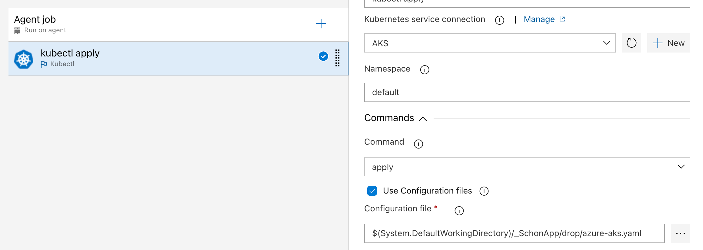

# Test
This a containerized python based app.

- Automating Docker image creation
- Automating Docker image upload to Azure Container Registry (ACR)

To Create CI in Azure Pipeline to Build and Push Docker Image to ACR (ACR and AKS already created with terraform script)
=========

- Create a pipeline in Azure DevOps
- Create a service connection for AKS and ACR in Azure DevOps 
- In azure-pipeline.yaml, edit the build code block with your Azure credentials. See Below:
```
  inputs:
    containerregistrytype: 'Azure Container Registry'
    azureSubscription: 'Azure subscription ID)'
    azureContainerRegistry: '{"loginServer":"ACR URL", "id" : "/subscriptions/Subscription_ID/resourceGroups/YOUR_RESOURCE_GROUP/providers/Microsoft.ContainerRegistry/registries/YOUR_ACR_NAME"}'
    action: 'Build an image'
    imageName: '$(Build.Repository.Name):YOUR_DESIRED_IMAGE_NAME'

```

- In azure-pipeline.yaml, edit the push code block with your Azure credentials. See Below:

```
  inputs:
  inputs:
    containerregistrytype: 'Azure Container Registry'
    azureSubscription: 'Azure subscription ID)'
    azureContainerRegistry: '{"loginServer":"ACR URL", "id" : "/subscriptions/Subscription_ID/resourceGroups/YOUR_RESOURCE_GROUP/providers/Microsoft.ContainerRegistry/registries/YOUR_ACR_NAME"}'
    action: 'Push an image'
    imageName: '$(Build.Repository.Name):YOUR_DESIRED_IMAGE_NAME'
```

- In azure-aks.yaml, edit the deployment code block with your ACR image details. See Below:

```
      containers:
      - name: schon-klinik-app
        image: YOUR_ACR_NAME.azurecr.io/IMAGE_NAME:VERSION (latest)
        ports:

```

To Create CI in Azure Pipeline to Build and Push Docker Image to ACR (ACR and AKS already created with terraform script)
=========
- Create Azure release (CD) pipeline
- Select your build artifact from the previous build
- On the task or agent job, select "deploy to kubernetes"
- Configure the AKS agent job and choose azure-aks.yaml as your configuration file (See screenshoot below)
- Create release



